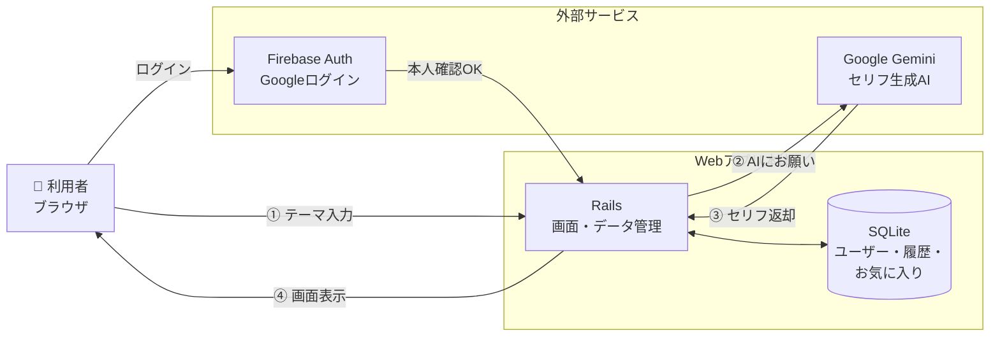
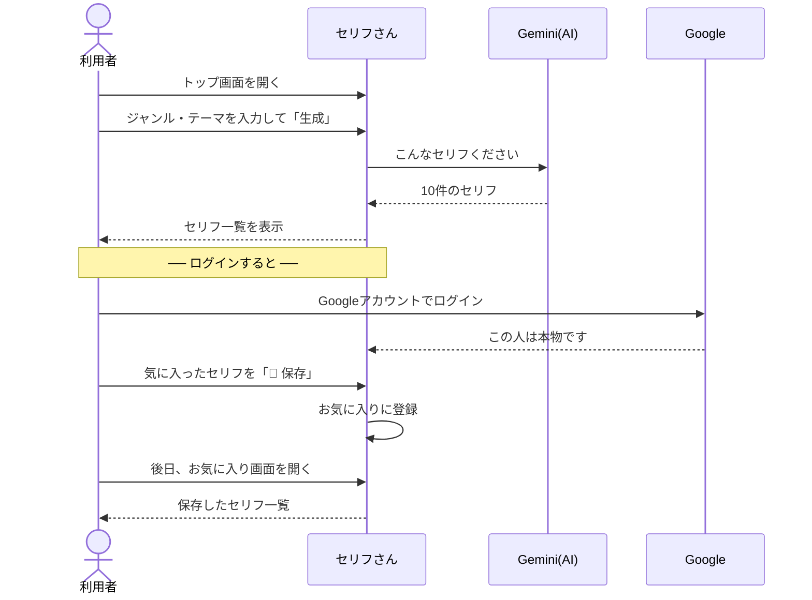

# セリフさん

VTuber さんの「セリフ枠配信」用に、AIがジャンルとテーマからセリフ候補を考えてくれる Web アプリです。

```
入力: 「ジャンル = 恋愛」「テーマ = 雨の日の告白」
   ↓
出力: 「雨の音に紛れて、ちゃんと聞こえるように言うね」
       「この雨がやむ前に、伝えたいことがあるの」
       …など 10 件
```

---

## 何ができるの？

| できること | 未ログイン | ログイン |
|---|:-:|:-:|
| セリフを生成する | ○（1日3回まで） | ○（無制限） |
| 生成結果を Twitter(X) でシェア | ○ | ○ |
| 気に入ったセリフを保存 |  | ○ |
| 過去の生成履歴を見返す |  | ○ |
| お気に入りにメモを書く |  | ○ |
| ジャンルで絞り込んで見る |  | ○ |

ログインは **Google アカウント1クリック**。パスワードの登録は不要です。

---

## 誰のためのアプリ？

- 週に何度も **セリフ枠配信** をする VTuber・ライバーさん
- 「毎回テーマを考えるのに疲れた…」「前に使ったやつをもう一度見たい」人
- スマホで気軽に・ブラウザだけで使いたい人（アプリのインストール不要）

---

## システム構成図



**ポイント:**
- AI 部分は Google 社の **Gemini** に任せている（自前で AI を持たない）
- ログイン認証は Google の **Firebase** に任せている（パスワード管理の事故を防ぐ）
- 画面とデータだけを自前で持つ、シンプルな作り

---

## 使ってもらう流れ



---

## 画面構成

| 画面 | 用途 |
|---|---|
| ホーム `/` | ジャンル・テーマを入れて生成するメイン画面 |
| 結果 `/result` | 生成された10件のセリフ一覧・シェア・保存 |
| お気に入り `/favorites` | 保存したセリフ一覧・メモ編集・削除 |
| 履歴 `/history` | 過去の生成結果を新しい順に表示 |
| アプリについて `/about` | アカウント情報・開発趣旨・お問い合わせ |

---

## 使っている技術

| 区分 | 採用 | 選んだ理由（ひとことで） |
|---|---|---|
| 画面・サーバー | Ruby on Rails 8 | 小規模〜中規模を1人で作るのに相性がよい |
| デザイン | Tailwind CSS | モック再現が速い |
| データベース | SQLite | 小さいうちは十分。必要になれば切替できる |
| AI | Google Gemini API | コスト・品質バランスが良い |
| ログイン | Firebase Auth (Google) | パスワード管理を Google に任せられる |
| テスト | RSpec | 動作を壊さず機能を足していくため |

---

## 開発のこだわり

- **TDD（テスト駆動開発）**：新機能を足す前に必ず「期待する動き」をテストとして書く
- **ログインしなくても使える**：初見の人の離脱を減らすため、まず生成を体験してもらう
- **パスワードを預からない**：事故リスクを減らすため Google 認証のみ
- **個人情報はほぼ持たない**：DBに保存するのは firebase_uid・email・表示名のみ

---

## ローカルで動かす

```bash
# 1. 依存パッケージを入れる
bundle install

# 2. データベースを作る
bin/rails db:prepare

# 3. 環境変数を用意する（GEMINI_API_KEY など）
#    → .env.example を参照

# 4. サーバー起動
bin/dev
# → http://localhost:3000 にアクセス
```

## テスト実行

```bash
bundle exec rspec
```

---

## 今後の予定

- [ ] 本番環境へのデプロイ（Render 予定）
- [ ] PWA 対応（スマホのホーム画面からアプリのように起動）
- [ ] X (Twitter) ログイン対応
- [ ] お問い合わせフォーム
- [ ] シェア用の画像生成

---

## 作者

個人開発（ポートフォリオ作品）
