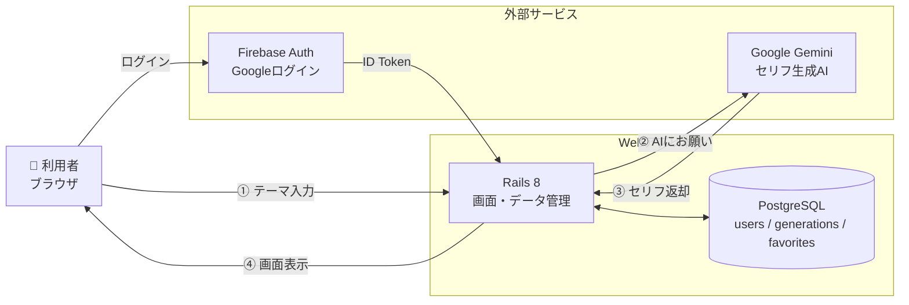

# セリフさん

VTuber・ライバー向け、AIが「セリフ枠配信」のセリフを10件提案するWebアプリ。

🔗 https://serifusan.onrender.com/

個人開発 ― 企画・設計・実装・テスト・デプロイ・運用

---

## なぜ作ったか

著者自身、ライブ配信アプリで数ヶ月ライバー活動をしていました。「セリフ枠」配信で、セリフはAIを使えば出せますが、

- 毎回プロンプトをコピペするのが面倒
- もっと簡単にセリフ一覧を出力したい

という自分の困ったに応える形で、**配信に出る直前のライバーがスマホで簡単に操作できる**ことを目的に設計した。ペルソナは当時の自分です。

---

## 何ができるか

```
入力：「ジャンル = 恋愛・甘々」「テーマ = 雨の日の告白」
   ↓
出力：配信向けの長さ（100〜140文字）のセリフを10件
```

| 機能 | 未ログイン | ログイン |
|---|:-:|:-:|
| セリフ生成 | ○（3回/日） | ○（30回/日） |
| X (Twitter) でシェア | ○ | ○ |
| いいねして保存 |  | ○ |
| いいねにメモを書く |  | ○ |
| 生成履歴を見返す |  | ○ |
| ジャンルで絞り込み |  | ○ |

ログインは **Googleアカウント1クリック**（パスワード登録なし）。

---

## 技術スタックと選定理由

| 区分 | 採用 | なぜ |
|---|---|---|
| Framework | Ruby on Rails 8 | 業務で触っている。1人で小〜中規模を作るのに手数が少ない |
| DB（開発／本番） | SQLite3 ／ PostgreSQL (Neon) | 開発は軽く、本番は Render から無料枠で接続 |
| CSS | Tailwind CSS v4 | モックの忠実再現が速い。カスタムは `@layer components` に集約 |
| AI | Google Gemini API (`gemini-2.5-flash-lite`) | コスト／品質のバランス。**gemを入れず `Net::HTTP` 直叩き**（依存を増やさない判断） |
| 認証 | Firebase Authentication + Google Identity Services | 自前でパスワード管理をしない。Rails側で **ID Token(JWT)を完全検証**してセッション発行 |
| ホスティング | Render (Starter) + Neon Postgres | Docker を使わず `bin/dev` で運用 |
| テスト | RSpec（**117例**） | TDDで進行。機能追加の前に期待挙動をテスト化 |
| 静的解析 | RuboCop (rails-omakase) | Rails 流儀を機械でチェック |
| セキュリティ監査 | Brakeman / bundler-audit | いずれも警告 **0件** |
| PWA | manifest + Service Worker | 配信者は大半スマホ。ホーム画面に追加してアプリ風に起動可能 |

### 検討して採用しなかったもの

- **Devise**：メール/PW 認証自体を採用しないため不要
- **Firebase Firestore**：当初検討。国内事例が少なく学習コストが高いので、慣れている ActiveRecord + PostgreSQL に寄せた（きかくさんと構成を揃えて学習を二重化しない狙いもあり）
- **Redis**：未ログインの日次制限はセッションcookieで十分。Redis追加は規模に対してオーバースペック
- **Rack::Attack**：アプリ層の日次ガードで当面の API 過課金は防げる。スパム対策が必要になった時点で導入する想定

---

## システム構成図



**設計上のポイント**
- AI 部分は Google の Gemini に任せている（自前で AI を持たない）
- 認証は Firebase（Google）に任せている（パスワード管理の事故を防ぐ）
- 画面とデータだけを自前で持つ、シンプルな三層

## 認証フロー（Firebase ID Token → Rails セッション）

```
[ブラウザ]
  Google Identity Services でサインイン
    → Firebase に credential を渡して signInWithCredential
    → Firebase が JWT(RS256) を発行

[ブラウザ → Rails]
  POST /sessions {id_token}  + X-CSRF-Token

[Rails: FirebaseTokenVerifier]
  ├ Google 公開鍵を取得・メモリキャッシュ（Cache-Control 準拠）
  ├ JWT 署名検証（RS256, kid 照合）
  ├ aud / iss / sub / exp / auth_time を全て検証
  └ OK なら reset_session でセッションIDを振り直し（固定攻撃対策）

→ 200 OK → ページリロードで通常セッションへ
```

---

## セキュリティ対策

| 対策 | 内容 |
|---|---|
| Firebase ID Token | JWT 完全検証（署名 ＋ iss / aud / sub / exp / auth_time） |
| セッション固定攻撃 | ログイン時 `reset_session` |
| CSRF | `X-CSRF-Token` 必須。fetch からの `/sessions` POST もヘッダー検証 |
| CSP | nonce方式。`unsafe-inline` 不採用。inline script は nonce 一致時のみ許可 |
| HSTS / HTTPS強制 | `force_ssl = true` + `assume_ssl = true`（Render の SSL 終端に対応） |
| DNS Rebinding | `config.hosts` で `*.onrender.com` に制限 |
| 入力長ガード | テーマ 200字 / キャラ 300字 / 一人称 20字 / 口調 20字で Gemini 送信前に切る |
| 生成回数ガード | セッション（未ログイン 3回/日） + DB（ログイン 30回/日） |
| Brakeman | 警告 **0件** |
| bundler-audit | 脆弱性 **0件** |

---

## DB スキーマ

```
users       id / firebase_uid(unique) / email / display_name / photo_url / provider
generations id / user_id / genre / theme / serifus(text, JSON配列) / timestamps
            ├─ index (user_id)
            └─ index (user_id, created_at)
favorites   id / user_id / serifu(text) / genre / memo / timestamps
            ├─ index (user_id, created_at)
            └─ unique_index (user_id, serifu)   # 二重いいね防止
contacts    id / name / email / body / timestamps
```

DBに保存する個人情報は `firebase_uid / email / display_name / photo_url` のみ。**パスワードハッシュは持たない**。

---

## テスト・静的解析・監査

```bash
bundle exec rspec                # 117 examples, 0 failures
bundle exec rubocop              # 33 files, no offenses
bundle exec brakeman             # 0 security warnings
bundle exec bundle-audit check   # 0 vulnerabilities
```

- Request spec 中心（モデルは薄め）
- Gemini API は `allow_any_instance_of(GeminiService).to receive(:call)` でモック
- Firebase 検証ロジック（`FirebaseTokenVerifier`）は単体 spec を作成

---

## 画面構成

| 画面 | 用途 |
|---|---|
| `/` | ジャンル・テーマを入れて生成するメイン画面 |
| `/result` | 生成された10件のセリフ一覧・シェア・いいね |
| `/favorites` | いいね一覧・メモ編集・削除・ジャンル絞り込み |
| `/history` | 過去の生成結果を新しい順に表示 |
| `/about` | アカウント情報・ログイン/ログアウト・アプリ情報 |
| `/contact` | お問い合わせフォーム |

---

## 開発方針

- **TDD**：新機能の前に「期待する動き」をテストで書く
- **未ログインでも使える**：初見で価値がわかる導線（離脱防止）。ログインはオプション扱い
- **パスワードを預からない**：Google 認証のみ。DBにハッシュすら持たない
- **AI 過課金を防ぐ**：入力長・生成回数・ジャンル値をすべてサーバー側でガード
- **モックと実装を一致させる**：モックHTMLを先に作り、それを忠実に再現してから中身を組む

---

## ローカルで動かす

```bash
bundle install
bin/rails db:prepare
cp .env.example .env   # GEMINI_API_KEY を記入
bin/dev                # → http://localhost:3000
```

## 作者

個人開発（ポートフォリオ作品）
